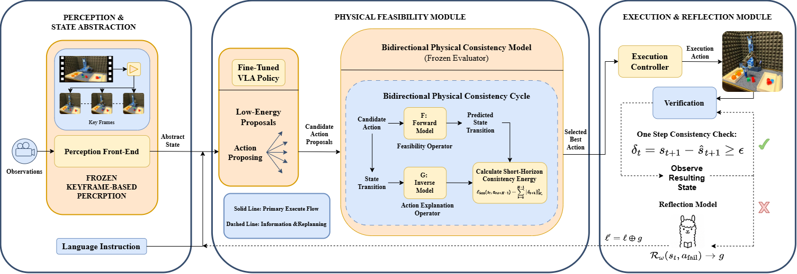
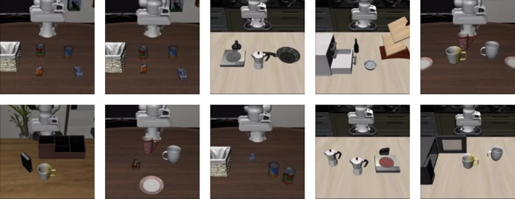

I am an undergraduate student in Artificial Intelligence at [Xiamen University](https://www.xmu.edu.cn/), advised by [Fei Chao](https://cogsci.xmu.edu.cn/info/1034/1249.htm).

I am broadly interested in robot learning and embodied AI. My current research focuses on Vision-Language-Action models, long-horizon manipulation, and reliable robot control. I am especially interested in what happens after a robot understands a task: how it can produce actions that are physically feasible, precise, and recoverable when execution does not go as planned.

In the long run, I hope to help build general-purpose robots that can work reliably in everyday environments, from homes to factories, handling tasks that are tedious, delicate, or dangerous. I hope my work can contribute to a growing effort toward robot intelligence that is not only expressive, but also dependable in the physical world.

## News

* **[Jun, 2026]** One paper was accepted to **IEEE/RSJ International Conference on Intelligent Robots and Systems (IROS 2026)**.

* **[Jun, 2026]** One paper was accepted to **IEEE International Conference on Systems, Man, and Cybernetics (SMC 2026)**.

* **[May, 2026]** I released a low-resource **RLT-style reproduction for VLA control**, built on **SmolVLA**, **LeRobot**, and **LIBERO**.

## Selected Research

  

    
  

  

    
PhysReflect-VLA: Physical Feasibility and Self-Reflective Regulation for Reliable Vision-Language-Action Policies

    
<strong>Jiayu Yang</strong>, Tao Yang, Weijun Li, Xiang Chang, Fei Chao, Changjing Shang, Qiang Shen

    
IEEE/RSJ International Conference on Intelligent Robots and Systems (IROS), 2026

    

      <a href="https://arxiv.org/abs/2606.27146">paper</a>
    

    
PhysReflect-VLA improves long-horizon VLA control through physical feasibility evaluation and self-reflective failure recovery.

  

  

    
  

  

    
PAMAE: Phase-Aware-MoE Action Experts Towards Reliable Flow-Matching Vision-Language-Action Policies

    
<strong>Jiayu Yang</strong>, Tao Yang, Xiang Chang, Fei Chao, Changjing Shang, Qiang Shen

    
IEEE International Conference on Systems, Man, and Cybernetics (SMC), 2026

    

      <a href="https://arxiv.org/abs/2606.27144">paper</a>
    

    
PAMAE introduces phase-aware mixture-of-experts action generation for more reliable flow-matching VLA policies in multi-stage manipulation.

  

  

    
  

  

    
RL Token Reproduction

    
<strong>Jiayu Yang</strong>

    
Open-source reproduction, 2026

    

      <a href="https://huggingface.co/Joeyfully/smolvla_rlt_libero_10">model</a> /
      <a href="https://huggingface.co/Joeyfully/smolvla_rlt_libero_10/resolve/main/RL%20Token%20Reproduction_Efficient%20and%20Accurate%20VLA%20Control%20via%20RL%20Token%20Representations%E2%80%93ppt.pptx?download=true">slides</a> /
      <a href="https://huggingface.co/Joeyfully/smolvla_rlt_libero_10/tree/main/videos">video</a>
    

    
A low-resource RLT-style reproduction for VLA control with SmolVLA, LeRobot, and LIBERO.

  

## Research Interests

Within robot learning, deep reinforcement learning, and embodied AI, I am particularly interested in:

**Robotics RL for foundation policies:** improve pretrained robot policies, especially Vision-Language-Action models, through reinforcement learning, value learning, and online/post-training adaptation, while preserving their semantic and behavioral priors.

**World models and physical consistency:** build internal models, verifiers, and self-consistency objectives that help robots predict the physical consequences of their actions, evaluate feasibility, and recover from execution failures.

**Hierarchical and phase-aware manipulation:** enable reliable long-horizon robot manipulation through temporal abstraction, skill-level control, and phase-aware refinement, especially for precise and contact-rich tasks.

A sample of other topics that I am also curious about: cross-embodiment generalization, generative models for robot behavior, and efficient adaptation of large robot foundation models.

I owe so much to the people who have generously mentored me, encouraged me, and inspired me with their vision and passion.

## Misc

