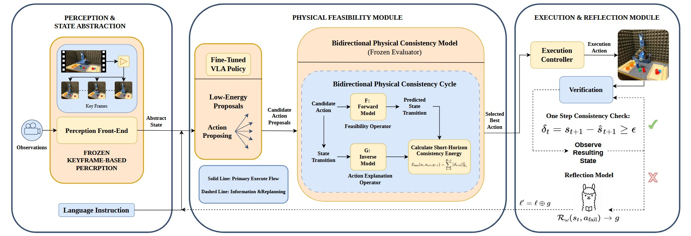
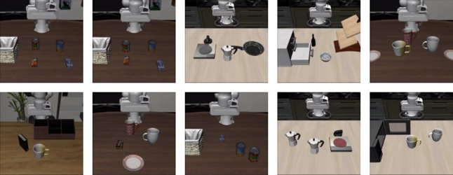

I am an undergraduate student in Artificial Intelligence at [Xiamen University](https://www.xmu.edu.cn/), advised by [Fei Chao](https://cogsci.xmu.edu.cn/info/1034/1249.htm).

I am broadly interested in robot learning and embodied AI. My current research focuses on Vision-Language-Action models, long-horizon manipulation, and reliable robot control. I am especially interested in what happens after a robot understands a task: how it can produce actions that are physically feasible, precise, and recoverable when execution does not go as planned.

In the long run, I hope to develop robot policies that retain the broad understanding of foundation models while acquiring the precision, physical awareness, and adaptability required for real execution. My goal is to help robots move beyond producing plausible actions and toward completing complex tasks reliably in changing, imperfect environments.

## News

* **[Jun, 2026]** One paper was accepted to **IEEE/RSJ International Conference on Intelligent Robots and Systems (IROS 2026)**.

* **[Jun, 2026]** One paper was accepted to **IEEE International Conference on Systems, Man, and Cybernetics (SMC 2026)**.

* **[May, 2026]** I released a low-resource **RLT-style reproduction for VLA control**, built on **SmolVLA**, **LeRobot**, and **LIBERO**.

## Selected Research

  

    
  

  

    
PhysReflect-VLA: Physical Feasibility and Self-Reflective Regulation for Reliable Vision-Language-Action Policies

    
<strong>Jiayu Yang</strong>, Tao Yang, Weijun Li, Xiang Chang, Fei Chao, Changjing Shang, Qiang Shen

    
IEEE/RSJ International Conference on Intelligent Robots and Systems (IROS), 2026

    

      <a href="https://arxiv.org/abs/2606.27146">paper</a>
    

    
PhysReflect-VLA improves long-horizon VLA control through physical feasibility evaluation and self-reflective failure recovery.

  

  

    
  

  

    
PAMAE: Phase-Aware-MoE Action Experts Towards Reliable Flow-Matching Vision-Language-Action Policies

    
<strong>Jiayu Yang</strong>, Tao Yang, Xiang Chang, Fei Chao, Changjing Shang, Qiang Shen

    
IEEE International Conference on Systems, Man, and Cybernetics (SMC), 2026

    

      <a href="https://arxiv.org/abs/2606.27144">paper</a>
    

    
PAMAE introduces phase-aware mixture-of-experts action generation for more reliable flow-matching VLA policies in multi-stage manipulation.

  

  

    
  

  

    
RL Token Reproduction

    
<strong>Jiayu Yang</strong>

    
Open-source reproduction, 2026

    

      <a href="https://huggingface.co/Joeyfully/smolvla_rlt_libero_10">model</a> /
      <a href="https://huggingface.co/Joeyfully/smolvla_rlt_libero_10/resolve/main/RL%20Token%20Reproduction_Efficient%20and%20Accurate%20VLA%20Control%20via%20RL%20Token%20Representations%E2%80%93ppt.pptx?download=true">slides</a> /
      <a href="https://huggingface.co/Joeyfully/smolvla_rlt_libero_10/tree/main/videos">video</a>
    

    
A low-resource RLT-style reproduction for VLA control with SmolVLA, LeRobot, and LIBERO.

  

## Research Interests

Within robot learning, deep reinforcement learning, and embodied AI, I am particularly interested in:

**Reliable robot execution and physical intelligence:** study how robot policies can move beyond semantic task understanding toward physically grounded, precise, and recoverable execution in real-world environments.

**Reinforcement learning for robot foundation models:** investigate how reinforcement learning can extend pretrained Vision-Language-Action policies, improving their execution capabilities and adaptability while preserving the semantic understanding and behavioral priors acquired during pretraining.

**Long-horizon and generalizable manipulation:** explore how robots can acquire, organize, and transfer underlying execution mechanisms across multi-stage, precision-demanding, and contact-rich tasks, enabling reliable adaptation to unseen or sparsely demonstrated tasks.

I am also interested in predictive world models, physical consistency, and efficient adaptation as complementary paths toward more reliable and generalizable robot intelligence.

I owe so much to the people who have generously mentored me, encouraged me, and inspired me with their vision and passion.

## Misc

In my free time, I enjoy reading, wandering through cities, and imagining food that I may or may not actually cook. During my first year of college, I often spent weekends traveling alone without a fixed destination — hopping between streets, stations, neighborhoods, and quiet corners of a city just to see where the day would take me. I also have a soft spot for old books, from Chinese classical literature to medieval writings, and for being a “cloud foodie” and imaginary-kitchen chef when real cooking is temporarily unavailable :)

Some of these interests have remained separate from my research; others have unexpectedly found their way back into how I think about robots and learning systems.

  <!-- 第一段占满页面宽度 -->
  

    Somewhere along the way, robotics also found an unexpected
    route back into one of my older interests: chess. I occasionally
    spend time with a small group of fellow chess enthusiasts who
    enjoy building and experimenting with their own chess engines.
    What began as casual conversations about strange moves, long
    games, and why a model suddenly forgets how the board works
    gradually turned into a fun exchange of ideas across two seemingly
    distant worlds.
  

  <!-- 图片从这里开始浮动，后面的文字会环绕它 -->
  

    
  

  

    I found myself borrowing intuitions from robot learning — action
    sequences, state tracking, generative policies, and the way small
    errors accumulate over time — and wondering how they might
    behave on a chessboard. Not every idea worked, of course, but that
    was part of the charm. We would propose something, test it in a
    few games, watch the engine produce either a surprisingly elegant
    line or complete nonsense, and then try again.
  

  

    I enjoy these experiments precisely because they are not part of my
    formal research agenda. They are a reminder that technical ideas
    can travel, that research does not always have to begin with a
    carefully written problem statement, and that sometimes the best
    way to understand a model is simply to play with it alongside
    people who share the same curiosity.
  

## A Final Note

I am sometimes asked why I chose artificial intelligence. I do not think there was a single moment when the answer suddenly became clear. It emerged gradually through models that failed in unexpected ways, ideas that worked only after many revisions, and the quiet satisfaction of watching something once confined to thought begin to perceive, decide, or act.

I still do not know exactly where this path will lead. There are many questions I have not learned how to ask yet, let alone answer. But perhaps that is precisely why artificial intelligence has become my answer: not because it offers certainty, but because it gives me a language for exploring the uncertain and a way to turn curiosity into something that can move in the world.

